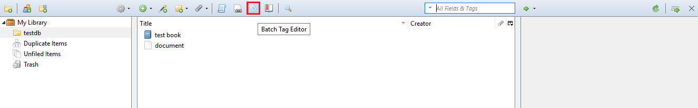
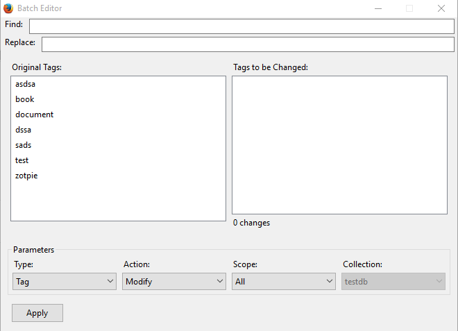

.. ZotPie documentation master file, created by
   sphinx-quickstart on Mon Nov 23 17:38:05 2015.
   You can adapt this file completely to your liking, but it should at least
   contain the root `toctree` directive.

Description
============
ZotPie is a open source plugin for Zotero (Firefox or Standlone) that was created to give members of the Zotero community several features that have been long overdue.

Welcome to ZotPie's documentation!
==================================
This is the user documentation for the ZotPie firefox plugin for Zotero. If you are a developer, you may be interested in the `developer documentation <./index_dev.html>`_.

.. toctree::
   :maxdepth: 2
	:getting started: Getting Started

Getting Started (short version)
================================

#. Download the plugin from `ZotPie Download Page <http://precision-dev.com/>`_ or `GitHub <https://github.com/CSCC01-Fall2015/team15-course-project/>`_ .
#. Install Zotero for FireFox
#. Open FireFox and Navigate to the Addons Menu
#. In settings (the gear icon w/ dropdown) select install addon from file and select the plugin
#. Restart Firefox and launch Zotero for Firefox or Zotero Standalone.

.. _my-reference-label:

Installing, Testing, Usage (Longer Version)
============================================

Detailed Installation Instructions
------------------------------------
#. Download the plugin from #downloadpage (idk yet), link to git install instructions if git is installer
#. Install Firefox & the Zotero FireFox Plugin
#. Open firefox and navigate to the dropdown menu |Settings| and then click on Add-ons. 
#. Click on the settings gearbox and then ``install addon from file``
#. Navigate to the .xpi file downloaded in the earlier steps and click **OK**
#. restart Firefox, if not prompted. Zotero should now have the plugin installed for Zotero (Firefox and Standalone).

Installing development versions
--------------------------------
ZotPie remains in development as of November 2015. Development Versions can be found on the GitHub dev branch. You
can also clone directly from a git enabled console by pasting: ``git clone http://github.com/repo``

Building Documentation
-----------------------
If you wish to build ZotPie's documentation for offline use, it can be built from the ``doc`` directory of a local git
repo by running ``make`` followed by the desired output format(s) (``html``, ``epub``, ``latexpdf``, etc.)

Batch Editing Tags 
===================
 This feature allows you to edit tags en masse, there are two ways to do this. The first is to open the batch editor (in Zotero) and then search for the tag you would like to change,delete,modify, or merge and click apply. The second is to manually add items to a batch editing queue and then open the batch editor and apply the changes to items in your queue.

Launching the Batch Tag Editor
----------------------------

#. Open Zotero (Firefox or Standalone)
#. Open the Batch Tag Editor by clicking on the Batch Tag Editor icon (see image below) |bedit_big|

Familiarizing yourself with the GUI
-----------------------------------
Upon launching the Batch Tag Editor a window similar to the one below should pop up, see the glossary below the image for a detailed explanation of the functionality of each section in the Batch Tag Editor window. The Batch Adding tags functionality GUI is slightly different see the Batch Adding Tags section for more information.

|btedit_window|

**Legend: (refer to image above)**
	Find
		The **Find** text-box is where you would type a tag name in order to sort through the tags displayed in the
		**Original Tags** section.
	Replace
		The **Replace** text-box (applicable only when modifying tags) is where you specify a tag name that would replace all tags in the **Tags to be changed** box. Note that these changes are only applied after you press the **Apply** button.
	Original Tags
		The **Original Tags** box displays all of the tags that are currently attached to the items in your library, collection, or queue. Clicking an item in this box adds it to the **Tags to be Changed** box to the right.
	Tags to be Changed
		Items in this box will be modified or removed depending on the mode specified in the **Action** dropdown menu. Changes will only be applied to your library, collection, or queue after pressing **Apply**.
	Parameters: Type
		The type of field you would like to edit, currently ZotPie only supports tags so dont worry about this.
	Parameters: Action
		The action you would like to perform on the tags in the **Tags to be Changed** section.
			#. Modify will replace tags in the **Tags to be Changed** section with whatever is specified in the **Replace** section
			#. Remove will remove all tags in the *Tags to be Changed** section from your library, collection, or queue.
			#. Add - see the Batch Adding Tags section.
	Parameters: Scope
		The scope in which the changes you want will be applied. If set to **All** changes will be applied to your entire library, if you select a **Collection** changes will only be applied to items that collection, if you are using a queue you would select **Items**.

	Parameter: Collection
		If the scope is set to collection, this will let you select the collection you would like changes to be applied to.
	Apply
		Applies all changes to items in scope or queue.

Batch Editing Tags using find & replace
-----------------------------------------
.. note::

	This section assumes you have gone through the above section **Familiarizing yourself with the GUI**. If at anytime you are confused about the functionality of the Batch Tag editor in the below tutorial, please see the above section.

If at any time you are confused about the functionality, please see the above section.

#. Open Zotero and click on the Batch Tag Editor icon (see the **Launching the Batch Tag Editor** section for help)
#. Select the **scope** in which you would like to edit.
#. If your scope is set to *Collection*, in the **Collection** dropdown menu select the collection you would like to apply changes to.
#. In the **Action** dropdown menu, select the action you would like to perform.
#. In the **Original Tags** section click on tags you would like to change/remove and they will be moved to the **Tags to be changed** section. If your library or collection contains a large amount of tags you may want to type individual tag names in the **Find** textbox to easily find the appropriate tags in the **Original Tags** section. If you are **Batch Removing Tags** skip to the last step.
#. In the replace text-box type a tag name to replace all items in the **tags to be changed** section.
#. Click Apply and you are done.

Batch Editing using a Batch Editing Queue
--------------------------------------------

.. batch-adding-tags:
Batch Adding Tags
-----------------
todo

.. warning::
	The batch editor does not backup any data before making changes, the only way to undo changes to your library made by the batch editor are:
		(a) backup your library before using the batch editor
		(b) use the batch editor again, with the tag parameters switch 

Adding Custom Fields
===================
#. Open Zotero (Firefox or Standalone)
#. todo

.. note::	
	
	Custom Data does not currently sync to your online Zotero Database, this functionality is still under development.
	
..	This feature is intended for organizational and aesthetic purposes only, custom fields will not sync to your online Zotero library as all custom data is stored in a local database. If you do not use the Zotero servers for syncing your library and instead use your own then it may be possible, with some tweaking, to have the custom database sync your data. This, however, should only be attempted by a developer - interested developers should see the `developer documentation <./index_dev.html>`_ for ZotPie.

Coupling Documents
===================
#. Open Zotero 

Citation Editor
===================
#. Open Zotero (for firefox)

Notes
=====
The ZotPie plugin applies all changes to your **local** Zotero library, If you do not have automatic syncing enabled you
will have to sync before changes to your library are applied on the Zotero servers.

Liscense
=========
ZotPie is liscensed under the `MIT Liscense <http://opensource.org/licenses/MIT>`_.
